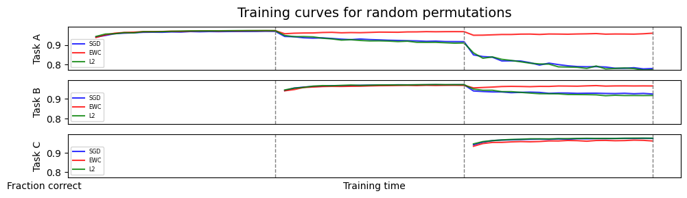
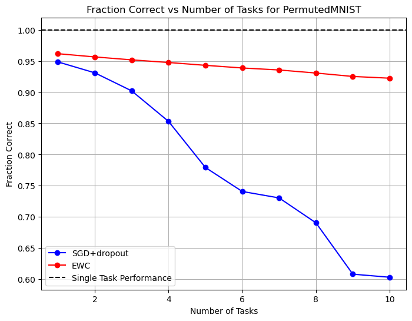

# EE411-Project
# Reproducibility Challenge: Overcoming catastrophic forgetting in neural networks


<p align="center">
  <a href="#about">About</a> •
  <a href="#data">Data</a> •
  <a href="#installation">Installation</a> •
  <a href="#method">Method</a> •
  <a href="#how-to-use">How To Use</a> •
  <a href="#credits">Credits</a> •
  <a href="#code-structure">Code Structure</a> •
  <a href="#results">Results</a> •
  <a href="#license">License</a>
</p>

<p align="center">
<a href="https://github.com/Blinorot/pytorch_project_template/blob/main/LICENSE">
   
</a>
</p>

## Team
The project is accomplished by team:

Jelisaveta Aleksic - @AleksicJelisaveta

Natasa Jovanovic - @natasa-jovanovic

Marija Rakonjac - @marijarakonjac

Strahinja Nikolic - @strajdzsha

Milica Vukasinovic - @milicavukaa

## About

This repository contains the work done for our [Fundamentals of Inference and Learning](https://edu.epfl.ch/coursebook/en/fundamentals-of-inference-and-learning-EE-411) project. The goal of our effort is to reproduce results obtained in (https://arxiv.org/pdf/1612.00796) where using Elastic Weight Consolidation, regularization technique in order to mitigate catastrophic forgetting in neural networks. Results are compared with L2 regularization and no regularization. Datasets are permutated and rotated MNIST dataset. 
## Data
Two datasets are used: PermutedMNIST - a unique fixed random permutation of the pixel values is applied for each task
as well as RotatedMNIST - ten tasks of rotating MNIST, where task i is
produced by a fixed rotation of 10(i−1) degrees). 


## Method

The method used in this project is based on the Elastic Weight Consolidation (EWC) algorithm, which helps mitigate catastrophic forgetting in neural networks. The implementation follows the original paper: ["Overcoming catastrophic forgetting in neural networks"](https://arxiv.org/pdf/1612.00796) by Kirkpatrick et al.

### Steps:

1. **Dataset Preparation**:
   - The MNIST dataset is used, with two variations: PermutedMNIST and RotatedMNIST.
   - The datasets are generated using the script [`generate_datasets.py`](generate_datasets.py), which includes the classes [`RotatedMNIST`](generate_datasets.py) and [`PermutedMNIST`](generate_datasets.py).

2. **Model Architecture**:
   - A custom neural network class [`CustomNN`](MNIST_functions.py) is defined with configurable hidden layers and dropout rates.

3. **Training**:
   - The training process is managed by the function [`train_model_on_task`](MNIST_functions.py), which supports training with standard SGD, L2 regularization, and EWC.
   - The EWC algorithm is implemented in the class [`EWC`](ewc.py), which includes methods to compute the Fisher Information Matrix, update parameter means, and compute the EWC loss.

4. **Experiments**:
   - Two main experiments are conducted to reproduce the results from the original paper:
     - **Experiment 2A**: Evaluates the performance of models trained with SGD, L2 regularization, and EWC on permuted MNIST tasks. This is executed using the function [`run_experiment_2A`](MNIST_functions.py).
     - **Experiment 2B**: Evaluates the performance of models trained with SGD and EWC on rotated MNIST tasks with hyperparameter search. This is executed using the function [`run_experiment_2B`](MNIST_functions.py).

5. **Execution**:
   - The main script [`run.py`](run.py) handles the execution of experiments based on command-line arguments, loading datasets, and saving results.


## How To Use

To run the experiments, use the main script [`run.py`](run.py). This script allows you to execute the experiments for generating figures 2A and 2B from the original paper.

### Running the Script

You can run the script from the command line with the following arguments:

```bash
python run.py --experiment <A or B> --task_type <permute or rotate> --num_tasks <number_of_tasks> [--seed <random_seed>] [--cuda] [--lambda_ewc <regularization_strength>]
```

- `--experiment`: Specify the experiment type (`A` or `B`).
- `--task_type`: Specify the task type (`permute` or `rotate`).
- `--num_tasks`: Specify the number of tasks (positive integer).
- `--seed`: (Optional) Specify the random seed (default: 42).
- `--cuda`: (Optional) Use CUDA if available.
- `--lambda_ewc`: (Optional) Specify the regularization strength for EWC (default: 10.0).

### Example Usage

To run experiment 2A with permuted MNIST tasks:

```bash
python run.py --experiment A --task_type permute --num_tasks 5
```

To run experiment 2B with rotated MNIST tasks:

```bash
python run.py --experiment B --task_type rotate --num_tasks 10 --lambda_ewc 5000
```

### Modifying Neural Network Parameters

For additional modifications of the neural network parameters, refer to the [`MNIST_functions.py`](MNIST_functions.py) script. This script contains the definition of the custom neural network class `CustomNN` and the training functions. You can adjust parameters such as the number of hidden layers, hidden layer size, dropout rates, and more within this script.


## Code Structure

```
│   .gitignore                # Specifies files and directories to be ignored by Git
│   ewc.py                    # Implementation of Elastic Weight Consolidation (EWC) method
│   generate_datasets.py      # Script to generate and preprocess datasets
│   MNIST_demo.ipynb          # Jupyter notebook for running experiments on MNIST dataset
│   MNIST_functions.py        # Helper functions for running experiments on MNIST dataset
│   plot_results.ipynb        # Jupyter notebook for plotting experiment results
│   README.md                 # Project documentation
│   run.py                    # Main script to run experiments
│   utils.py                  # Utility functions used for plotting
│
├───atari                     # Directory containing Atari-specific code
│       EWC_atari.py
│       memory.py
│       models.py
│       test.py
│
├───results                   # Directory containing experiment results
│       acc_2a_10k.png
│       acc_2a_20k.png
│       acc_2a_50k.png
│       acc_2a_5k.png
│       experiment2A_results_permutated_10k.csv
│       experiment2A_results_permutated_20k.csv
│       experiment2A_results_permutated_50k.csv
│       experiment2A_results_permutated_5k.csv
│       experiment2A_results_rotated.csv
│       experiment2B_results_permute.csv
│       experiment2B_results_rotate.csv
│       fraction_correct_permute.png
│       fraction_correct_permute_ewc.csv
│       fraction_correct_permute_sgd.csv
│       fraction_correct_rotate.png
│       fraction_correct_rotate_ewc.csv
│       fraction_correct_rotate_sgd.csv
```

## Results

### Experiment 2A: Performance on PermutedMNIST and RotatedMNIST

In Experiment 2A, we evaluated the performance of models trained with SGD, L2 regularization, and EWC on permuted and rotated MNIST tasks. The results are shown in the following figures:

#### PermutedMNIST


#### RotatedMNIST


### Experiment 2B: Average Performance Across All Tasks

In Experiment 2B, we assessed the average performance of models trained with SGD and EWC on rotated MNIST tasks with hyperparameter search. The results are depicted below:

#### PermutedMNIST


#### RotatedMNIST


The results demonstrate that EWC effectively mitigates catastrophic forgetting compared to SGD and L2 regularization, particularly in the permuted MNIST tasks.


## Credits
This work was carried out as part of a reproducibility challenge, to validate the findings presented in the study (https://arxiv.org/pdf/1612.00796). We acknowledge the authors of the original paper for their contributions that inspired this reproduction effort. 


## Group Contributions

- Jelisaveta Aleksic: Scripts for generating datasets and training, running experiments for 2A rotated and permutated MNIST, writing README
- Natasa Jovanovic: Implementing and experimenting with DDQN and EWC for Atari games, refactoring the code for running the 2A and 2B experiments, running 2B experiments for permutated and rotated MNIST, writing report, writing run script
- Marija Rakonjac: Scripts for experimenting and visualizing results, implementing models, writing report
- Strahinja Nikolic: EWC implementation, running experiments for 2A permutated MNIST, writing README, cleaning code, reviewing report
- Milica Vukasinovic: Scripts for training and running experiments, EWC implementation, writing report

## License

[](/LICENSE)
